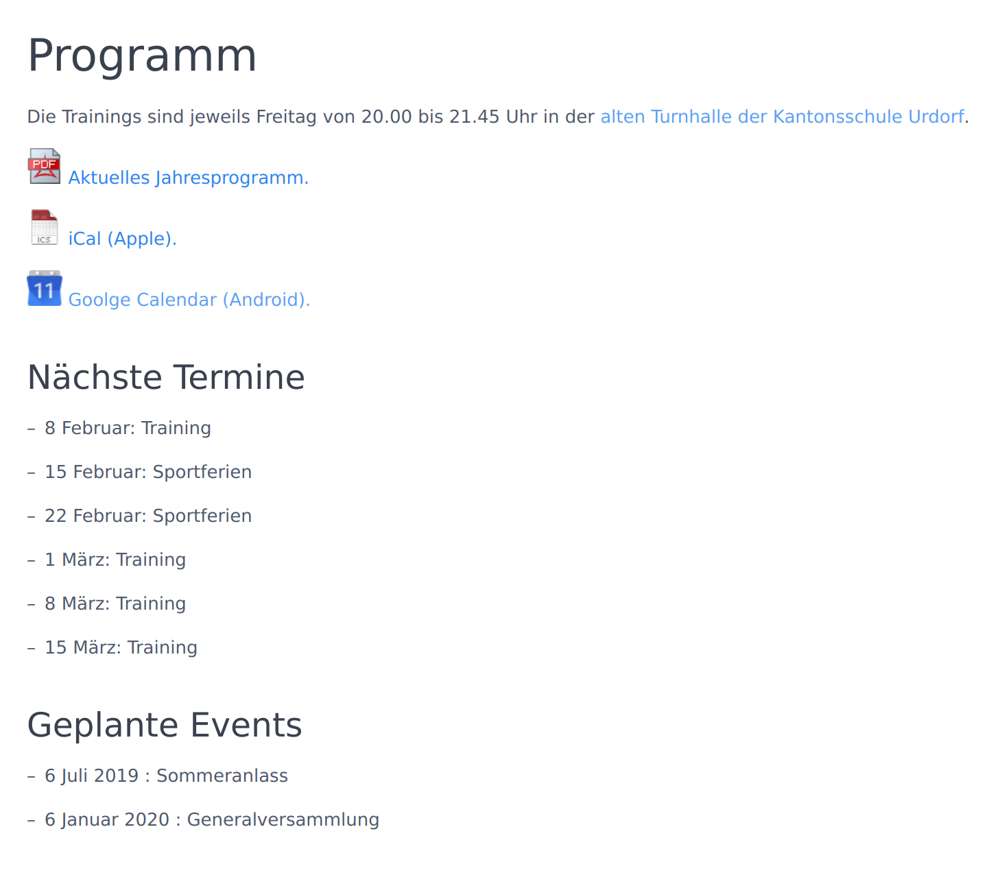

# Events Schedule Plugin

List events defined in a simple `yaml` file.

This plugin has been created for a Badminton Club with weekly trainings, school holidays without trainings, and social events a couple of time a year.

The **Events Schedule** Plugin is for [Grav CMS](http://github.com/getgrav/grav).

## Installation

Installing the Events Schedule plugin can be done in one of two ways. The GPM (Grav Package Manager) installation method enables you to quickly and easily install the plugin with a simple terminal command, while the manual method enables you to do so via a zip file.

### GPM Installation (Preferred)

The simplest way to install this plugin is via the [Grav Package Manager (GPM)](http://learn.getgrav.org/advanced/grav-gpm) through your system's terminal (also called the command line).  From the root of your Grav install type:

    bin/gpm install events-schedule

This will install the Events Schedule plugin into your `/user/plugins` directory within Grav. Its files can be found under `/your/site/grav/user/plugins/events-schedule`.

### Manual Installation

To install this plugin, just download the zip version of this repository and unzip it under `/your/site/grav/user/plugins`. Then, rename the folder to `events-schedule`. You can find these files on [GitHub](https://github.com/aoloe/grav-plugin-events-schedule) or via [GetGrav.org](http://getgrav.org/downloads/plugins#extras).

You should now have all the plugin files under

    /your/site/grav/user/plugins/events-schedule
	
> NOTE: This plugin is a modular component for Grav which requires [Grav](http://github.com/getgrav/grav) and the [Error](https://github.com/getgrav/grav-plugin-error) and [Problems](https://github.com/getgrav/grav-plugin-problems) to operate.

### Admin Plugin

If you use the admin plugin, you can install directly through the admin plugin by browsing the `Plugins` tab and clicking on the `Add` button.

## Configuration

Before configuring this plugin, you should copy the `user/plugins/events-schedule/events-schedule.yaml` to `user/config/plugins/events-schedule.yaml` and only edit that copy.

Here is the default configuration and an explanation of available options:

```yaml
enabled: true
```

Note that if you use the admin plugin, a file with your configuration, and named events-schedule.yaml will be saved in the `user/config/plugins/` folder once the configuration is saved in the admin.

## Usage

### Defining the scheduled events

Add a `schedule.yaml` file in your `/data/plugins/events-schedule/` directory: 

```yaml
- date: 20150109
- date: 20150115
  event: true
  label: Generalversammlung
- date: 20150116
- date: 20150123
- date: 20150130
- date: 20150206
- date: 20150213
  label: Sportferien
```

The following fields are supported:

- `date`: the date of the event (mandatory).
- `start`: start time (a default value is defined).
- `end`: end time (a default time is defined).
- `event`: the text to be shown (a default label is defined).
- `label`: the text to be shown (a default label is defined).
- `active`: false when the event is "cancelled".

When they are not specified, all the fields but the `date` are filled with default values:

- `start` and `end` times have default times.
- `event`: is false by default
- the `label` is filled with a default value, except for events: in that case it is mandatory.
- `active`: almost always true, except if a label is defined but event is not (the `label` explains why the event does not take place).

The following fields are not yet fully supported:

- `location`.
- `url`.
- `summary`.

Warning: currently, this plugin is only used for one single site and some strings are hardcoded. If (pull) requested, I can let the user properly define them.

### Rendering  the list

Create an `events-schedule.md` page to  get a list of the next events.

The list is created by the `events-schedule.html.twig` template.

The list can be rendered as:


### Rendering a short list


Create a `events-schedule-next.md` module to  get a list of the next events.

The list is created by the `events-schedule-next.html.twig` template.

The list can be rendered as:



## Todo

- [ ] Use the `language.yaml` file?
